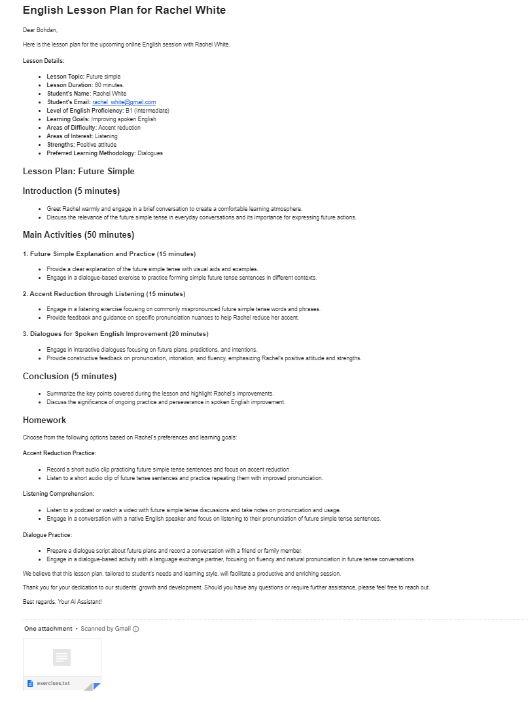
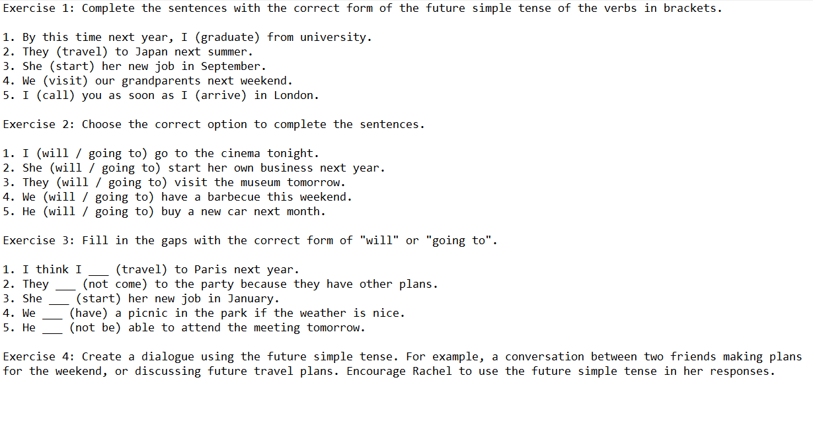

# AI Assistant For English Teacher

Welcome to the AI Assistant For English Teacher! This project is designed to assist English teachers in preparing for their lessons efficiently and effectively. By leveraging the power of LLMs, this program helps create detailed lesson plans and practical exercises tailored to the specific needs of students.


## Models
* Lesson Plan Generator: This model generates a detailed lesson plan based on: lesson subject, student data and lesson duration.
 
* Exercise Generator: This model creates practical exercises tailored to the lesson plan. The exercises can be used during the lesson or assigned as homework.

Both models are based on OpenAI's GPT-4, ensuring high-quality and contextually appropriate content generation.  
Additionally, I've employed few-shot learning methodology to enhance the adaptability and accuracy of these models.

## Sending Lesson Plans via Email
The _send_plan_ function allows to send generated lesson plans and lesson information directly to the teacher's email.

## Plan example
### Lesson plan sent by email


### Practical exercises in attachment


## Usage

### Requirements
* Python 3

### Setup
* Clone repository
```bash
  git clone https://github.com/Boohdaaaan/AI-Assistant-For-Teachers.git
```

* Move to project folder
```bash
  cd AI-Assistant-For-Teachers
```


* Install dependencies
```bash
  pip install -r requirements.txt
```

* Set environment variables in the .env file
```bash
  echo "OPENAI_API_KEY=your-api-key-goes-here" > .env
  echo "PASSWORD_EMAIL_APP=password-goes-here" > .env
```

* Start the project
```bash
  python src/main.py  
```


## Acknowledgments
Special thanks to the developers and communities behind the libraries and tools used in this project for their valuable contributions.